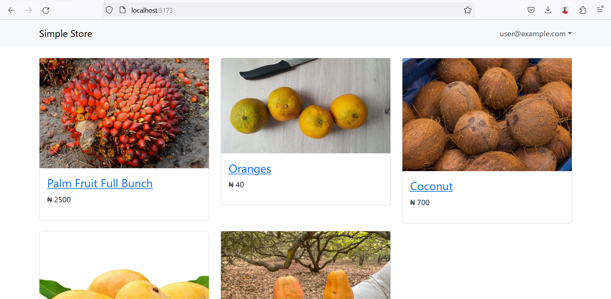

# simple-store

This project demonstrates how to use Firebase in Vue 3.

The project is an example online store that's powered by [Firebase](https://firebase.google.com/). On the example app you can do the following:

- Add items to inventory
- View all items in the store
- View details page for a single item
- Place an order
- Dashboard where you can view all items and remove items.



## Firebase Features Used
- Authentication (Email and Password)
- Cloud Firestore (database)
- Storage (Hosting photos of store items)

## Project Setup

### Configure Firebase
- Create a new Firebase project or connect your project to an exisiting one.
- Add Firebase configuration to `.env` file. You can copy the content of `.env.example` to your new `.env` then add your project configurations.

```sh
npm install
```

### Compile and Hot-Reload for Development

```sh
npm run dev
```

### Compile and Minify for Production

```sh
npm run build
```

## Recommended IDE Setup

[VSCode](https://code.visualstudio.com/) + [Volar](https://marketplace.visualstudio.com/items?itemName=Vue.volar) (and disable Vetur) + [TypeScript Vue Plugin (Volar)](https://marketplace.visualstudio.com/items?itemName=Vue.vscode-typescript-vue-plugin).

## Customize configuration

See [Vite Configuration Reference](https://vitejs.dev/config/).


